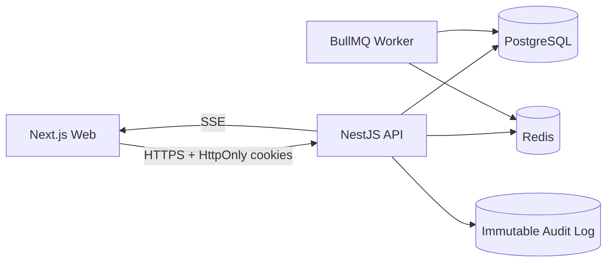

# NordFlow — Intelligent Work & Resource Coordination Platform

NordFlow is a production-oriented multi-tenant SaaS portfolio project for coordinating people, equipment, locations, project schedules, budgets, and operational capacity. Its differentiating capability is a deterministic conflict engine that detects operational risk and an explainable recommendation engine that proposes changes without applying them automatically.

## What this demonstrates

- Next.js 16 + TypeScript + React + Tailwind CSS 4
- NestJS 11 REST API with OpenAPI
- PostgreSQL + Prisma ORM 7
- Redis + BullMQ background processing
- Secure cookie-based authentication with rotating sessions
- Tenant isolation and RBAC
- Deterministic conflict detection
- Explainable, approval-gated recommendations
- Server-Sent Events for authorized real-time updates
- Audit logging and request correlation IDs
- CSV reporting and dashboard analytics
- Unit, integration, security, and browser E2E test scaffolding
- Docker + GitHub Actions

## Local setup

1. Copy `.env.example` to `.env`.
2. Start infrastructure: `docker compose up -d postgres redis`.
3. Install dependencies: `npm install`.
4. Generate Prisma Client: `npm run db:generate`.
5. Apply migrations: `npm run db:migrate`.
6. Seed the demo data: `npm run db:seed`.
7. Start API and web: `npm run dev`.

Web: http://localhost:3000  
API: http://localhost:4000  
Swagger: http://localhost:4000/docs

## Demo account

Owner: `owner@northstar.demo`  
Password: `NordFlow!2026`

Two additional demo tenants are seeded so cross-tenant isolation can be tested.

## Architecture

The API is intentionally modular rather than split into microservices. The conflict engine is a pure domain service, while persistence, HTTP, queues, and real-time delivery remain infrastructure boundaries around it.

## Domain model

Organization → memberships → users/roles/permissions.  
Projects contain tasks. Tasks receive resource assignments. Employee resources link to employee profiles, skills, availability, work-hour policies, and locations. Equipment resources link to equipment and maintenance windows. Budgets and cost entries feed financial risk rules. Conflicts reference the affected projects/resources and generate approval-gated recommendations.

See `docs/domain.md` and `docs/diagrams/er.mmd`.

## Security model

Every protected request resolves a user membership and organization from the signed access token. Tenant-scoped services require the organization ID before querying tenant-owned entities. Controllers never expose Prisma entities directly. Validation pipes, secure headers, request correlation IDs, rate limiting, CSRF double-submit protection, bcrypt password hashing, rotating refresh sessions, and audit logging are included.

See `docs/security.md`.

Validation notes are in `docs/validation.md`.

## Conflict engine

The deterministic engine evaluates:

1. employee overlap
2. equipment overlap
3. skill/certification gaps
4. availability violations
5. working-hour violations
6. location conflicts
7. deadline risks
8. resource over-utilization
9. budget warnings
10. maintenance conflicts

Each finding stores a fingerprint, severity, explanation, affected entities, detection time, and status. Recommendations are generated from the finding context, stored, and only applied after an explicit user approval.

See `docs/conflict-engine.md`.

## Performance decisions

- Composite indexes put `organizationId` first for tenant filtering.
- Assignment queries index resource/time windows for overlap detection.
- Transactional writes use optimistic version fields where concurrent edits are possible.
- Conflict detection is queue-backed so mutation requests do not wait for organization-wide scans.
- Dashboard/reporting endpoints aggregate on indexed columns and paginate audit/activity feeds.
- React Query deduplicates client fetches and uses targeted invalidation.

See `docs/performance.md`.

## Production deployment

A pragmatic small-team deployment is a managed PostgreSQL instance, managed Redis, one containerized API, one containerized Next.js web service, and a worker process. TLS terminates at the edge, secrets stay in the platform's secret manager, database backups are enabled, migrations run as a release step, and application logs include correlation IDs.

See `docs/deployment.md`.

## Portfolio presentation

The repository also contains a technical case study, interview discussion guide, architecture trade-offs, security trade-offs, database decisions, and a resume/LinkedIn draft in `docs/portfolio/`.

## Limitations called out honestly

This starter is production-oriented but still portfolio-sized: email delivery is an adapter boundary rather than a configured provider, SSE events are fanned out through Redis pub/sub between API and worker processes, while short replay history is kept per API process, and observability integrations are represented through structured logs and metrics hooks rather than a hosted vendor lock-in. These are deliberate trade-offs, not hidden claims of enterprise completeness.
