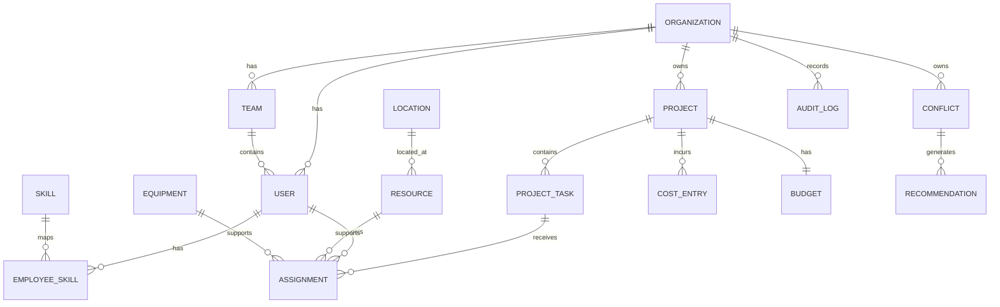

# Domain and database model

## Primary entities

Organization, User, Team, Role, Permission, Project, ProjectTask, Skill, EmployeeSkill, Resource, Equipment, Location, Schedule, Assignment, Availability, WorkHourPolicy, Budget, CostEntry, Conflict, Recommendation, Notification and AuditLog.

## Key constraints

- A tenant-owned row is scoped to exactly one organization.
- An assignment references a task and a resource.
- Overlapping employee assignments are prohibited by domain validation unless an authorized override is recorded.
- Equipment assignment must account for time overlap and location.
- Skill requirements are checked against the employee skill/certification record.
- Recommendation approval is an explicit state transition and audit event.
- Audit records have no normal update/delete endpoint.

## Indexing priorities

Index foreign keys and common filters first: `(organization_id)`, `(organization_id, status)`, `(project_id, start_at)`, `(resource_id, start_at, end_at)`, `(employee_id, date)`, and conflict status/severity. Use composite indexes based on actual query plans after production telemetry is available.
