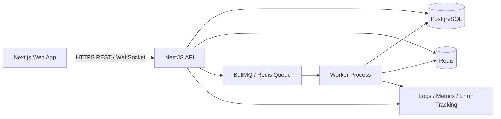

# Production architecture blueprint

## Core boundary

The browser is an untrusted client. Authentication, tenant membership, authorization, conflict writes and recommendation approval must be enforced on the server.

## Modular monolith recommendation

Start as one deployable API codebase with clear modules:

- Identity & access
- Organizations
- People & teams
- Skills & certifications
- Projects & tasks
- Resources & equipment
- Planning & assignments
- Conflict engine
- Recommendation engine
- Notifications
- Reporting
- Audit

This avoids premature microservices while keeping domain boundaries explicit. A future extraction should happen only when operational load or team ownership justifies it.

## Event flow

1. A manager proposes an assignment.
2. The API authenticates the session and authorizes the organization and resource.
3. The assignment is saved in a transaction.
4. An outbox/event is written.
5. A worker recalculates relevant conflicts asynchronously.
6. Notifications are emitted.
7. Clients receive a WebSocket/SSE event.
8. Recommendations remain pending until a permitted user explicitly approves them.

## Multi-tenancy

Use `organization_id` on tenant-owned entities. Resolve the active organization from the authenticated membership on the server; never trust an arbitrary organization identifier sent by the browser. Every query must apply tenant scoping, and high-risk tables should add database-level safeguards where appropriate.

## Real-time rules

Use authenticated channels. Events should include a monotonically increasing event id or server timestamp, and clients should tolerate reconnects and re-fetch authoritative state after a missed-event window.
